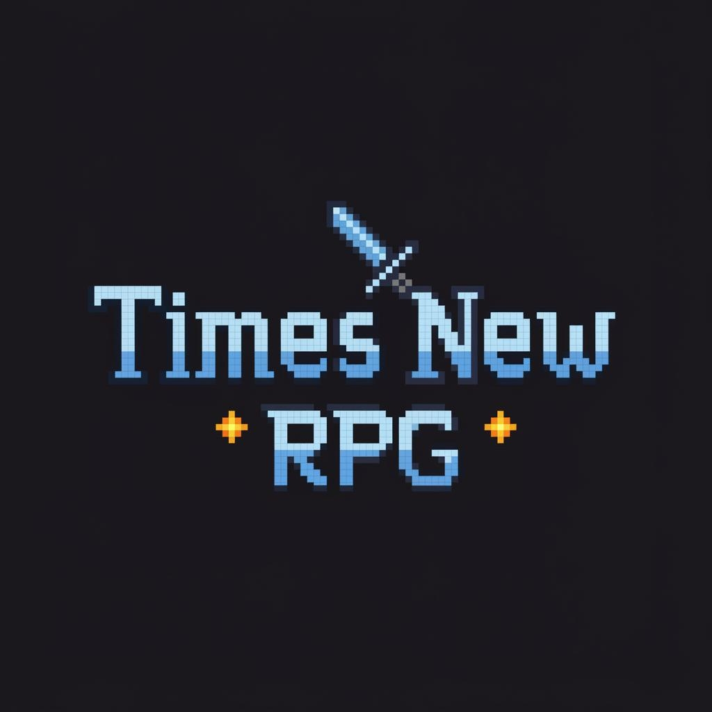

# Times new RPG

<video width="640" height="480" controls>
  <source src="readme/Raylib 2D RPG.mp4" type="video/mp4">
  Your browser does not support the video tag.
</video>

Times new RPG is a retro top down RPG with a plot centered around time loop

Exploration of C++ and game design! I built this game as a way to explore game dev and explore the use of AI for improved gameplay. 

The goal of this project is to create a package that allows a plug and play method to train game bosses using Reinforcement Learning methods

Built with C++ and [raylib](https://www.raylib.com/). 

## Features
- Top-down tile-based world and dungeon
- Player and enemy movement
- Combat with projectiles
- Collectible items and chests
- Multiple sound effects and background music
- Camera following the player
- Simple AI for enemies

## Screenshots

## Getting Started

### Prerequisites
- C++17 compatible compiler (e.g., MinGW-w64, MSVC)
- [raylib](https://www.raylib.com/) (included as submodule/external)
- CMake or Make (for building)

### Building
#### Windows (Visual Studio)
1. Open `rpgtest.sln` in Visual Studio 2022
2. Build the solution

#### Windows (MinGW-w64)
1. Run `build-MinGW-W64.bat`

#### Cross-platform (Makefile)
1. Run `make` in the project root

### Running
- The executable will be in `bin/Debug/Times-New-RPG.exe` or `bin/Debug/rpgtest.exe`
- Run the game from the terminal or by double-clicking the executable

### Controls
- **WASD**: Move player
- **Mouse Left Click**: Shoot 
- **Mouse Right Click**: Special attack
- **E**: Enter/exit dungeon
- **G**: Collect chest

## Project Structure
- `src/` - C++ source files
- `include/` - Header files
- `assets/` - Sprites, music, sound effects
- `bin/` - Compiled binaries
- `build/` - Build scripts and files
- `resources/` - Duplicate assets for packaging

## Credits
- [raylib](https://www.raylib.com/) for graphics/audio
- OpenGameArt for some sprites and sounds
- [Sprites](https://totuslotus.itch.io/characterpack)
- [Background](https://totuslotus.itch.io/characterpack)

## Game Structure

The game is built around a top-down tile-based map. The player, enemies, and interactive objects  are all represented as entities on this grid. Each iteration the following get updated:

- Player and enemy movement and actions
- Camera position to follow the player
- Projectile updates and collision detection
- Sound and music playback based on game events
- Tile map rendering for the current zone

## Reinforcement Learning

This project implements two reinforcement learning models for training AI enemies: Q-Learning and Deep Q-Learning (DQN). The AI learns to control enemy behavior by observing game states and receiving rewards based on actions taken.

### How the Server Works

The reinforcement learning training and inference occurs through a client-server architecture:

- **Client (Game)**: The C++ game captures screenshots and sends them to the Python server via ZeroMQ messaging.
- **Server (RL.py and server.py)**: The Python server processes the images, uses the RL models to decide actions, and sends responses back to the game.
- **Communication**: Uses asynchronous messaging with JSON payloads containing image data, rewards, and episode completion flags.

### Inference Process

During inference (non-training mode), the AI uses learned policies to make decisions:

1. Game captures a screenshot (every 3rd frame at 30 FPS = ~10 FPS capture rate)
2. Image is sent to server via ZeroMQ
3. Server processes image through the trained model
4. Model outputs an action (e.g., MOVE_UP, MOVE_DOWN, ATTACK)
5. Action is sent back to game, enemy performs the action

### Q-Learning Model

Q-Learning is a model-free reinforcement learning algorithm that learns a Q-table mapping states to action values.

**How it works:**
- **Q-Table**: A table where rows are states (discretized game positions) and columns are actions (MOVE_LEFT, MOVE_RIGHT, etc.)
- **Learning**: Updates Q-values using the Bellman equation: Q(s,a) = Q(s,a) + α[r + γ max(Q(s',a')) - Q(s,a)]
- **Policy**: ε-greedy policy for exploration vs exploitation

**Training Process:**
1. Initialize Q-table with zeros
2. For each episode:
   - Reset game state
   - While episode not done:
     - Choose action (explore or exploit)
     - Execute action, observe reward and new state
     - Update Q-value for (state, action) pair
     - Repeat
3. Save Q-table to file (assets/qtable.txt)

**State Representation**: (player_x, player_y, enemy_x, enemy_y, enemy_health) discretized to grid coordinates.
**Actions**: MOVE_LEFT, MOVE_RIGHT, MOVE_UP, MOVE_DOWN, FIRE_PROJECTILE
**Rewards**: +10 for hitting player, -10 for getting hit, ±100 for win/loss, -0.1 for each step

### Deep Q-Learning (DQN) Model

Deep Q-Learning uses a convolutional neural network to approximate the Q-function, allowing it to work with raw pixel inputs.

**How it works:**
- **Network Architecture**: CNN with convolutional layers for image processing, followed by fully connected layers for Q-value estimation
- **Experience Replay**: Stores transitions in a replay buffer and samples mini-batches for training stability
- **Target Network**: Separate network for computing target Q-values, updated periodically to reduce oscillations

**Training Process:**
1. Initialize DQN network and target network
2. For each episode:
   - Reset game state
   - While episode not done:
     - Choose action using ε-greedy policy
     - Execute action, observe reward and next state
     - Store transition in replay buffer
     - Sample mini-batch from buffer
     - Compute target Q-values using Bellman equation
     - Train network to minimize MSE between predicted and target Q-values
     - Update target network periodically
3. Save model weights to file (server/models/dqn_model.pth)

**State Representation**: Raw RGBA pixel data (1100x950 resolution, downscaled to 64x64 for network input)
**Actions**: Same as Q-Learning (5 actions)
**Rewards**: Same reward structure as Q-Learning
**Network Details**: Input: 64x64x3 (RGB), Output: 5 Q-values (one per action)

## License
This project is for educational and personal use. See individual asset files for their respective licenses.
